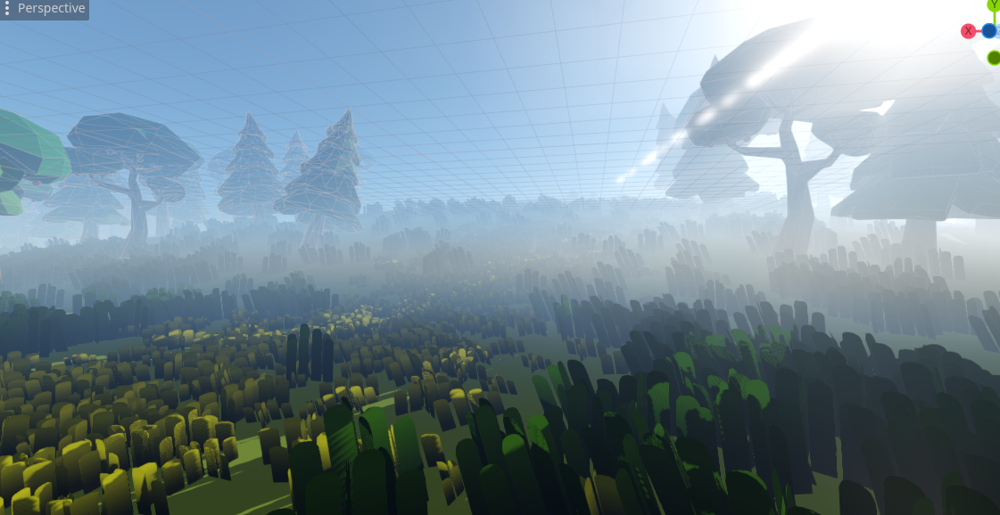
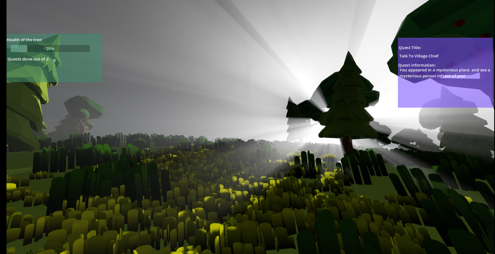
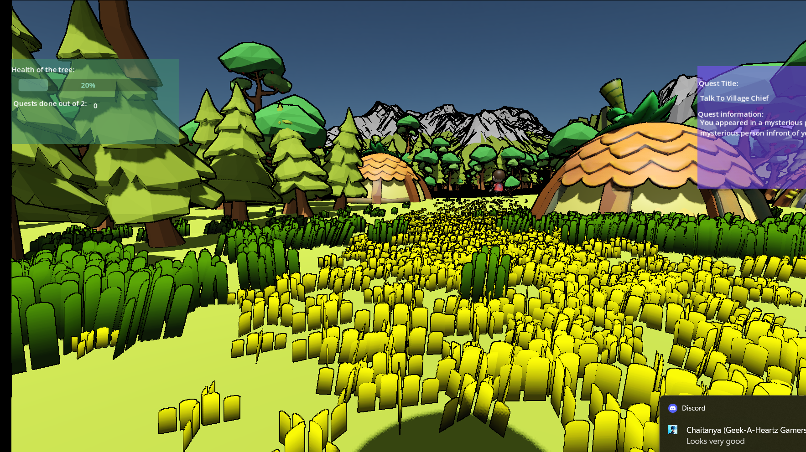

# Save Trees, Save Yourselves

**Save Trees, Save Yourselves** is a 3D RPG game made using godot 4 where players embark on a mission to save the Elder Tree, the vital  head of a village, which is dying due to pollution. The game combines environmental awareness with engaging gameplay, offering quests that challenge players to restore balance and vitality to the world.

## Storyline

The Elder Tree, a sacred and life-giving entity, is  dying due to effects of industrial pollution. As the village’s hope wanes, the player must:

- Stop a factory poisoning the environment.
- Assist a local fisher impacted by the pollution.
- Complete various quests to rejuvenate the village and save the Elder Tree.

## Features

- Immersive 3D environments.
- A compelling narrative with dialogues 
- Diverse quests 

## Goal

To help the villagers and the tree

## How to Play

1. Explore the village and surrounding areas.
2. Complete quests to combat pollution 
3. Restore the vitality of the Elder Tree to save the village.

### Remember: *Save the trees, and you save yourselves.*
